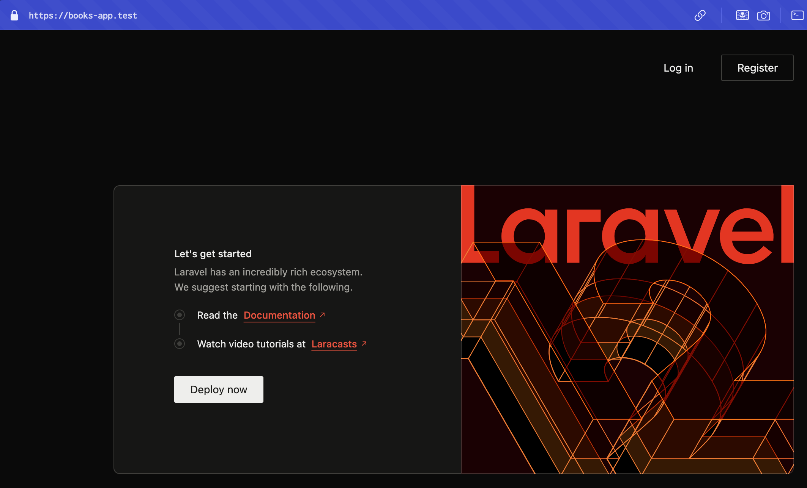
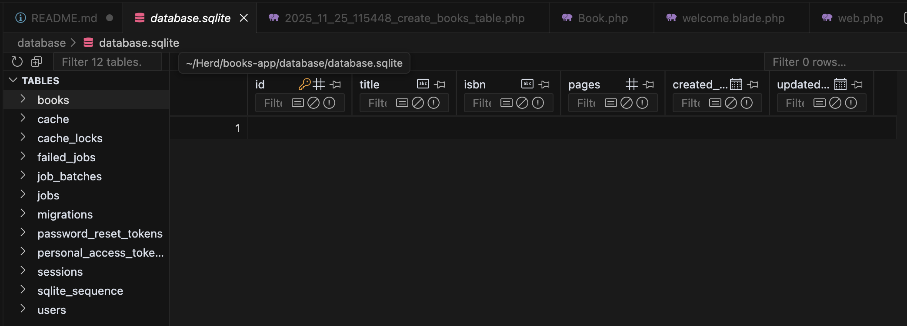

# Books-App

## Installation

Installation mittels

```cmd
laravel new books-app
```

Die weitere Arbeit erfolgt in einem Code Editor wie Visual Studio Code oder PHPStorm. Bei der Bearbeitung wird `composer run dev` verwendet. Dadurch werden die Stile (css, js, ...) korrekt angezeigt.

## Konfiguration

Laravel wird in einer DAtei namens `.env` konfiguriert. Diese Datei muss besondern geshchützt werden, da sie auch Zugangsbeinhalten. Die Speicherung darf innicht in einem Repository erfolgen.

Ein Key (`APP_KEY`) kann mittels `php artisan key:generate` erstellt werden. Standardmäßig wird die `.env`-Datei mittels -`.gitignore`-Datei geschützt.

In der `.env`-Datei befindet sich auch Zugang zur Datenbank. Standardmäßig wird mit `Sqlite` gearbeitet. Wird auf eine andere DB umgestellt, so muss der Konfigurationseintrag `DB_CONNECTION` entsprechend angepasst werden _(z.B. mysql inkl. Benutzerdaten)_. Nach `php artisan migrate` werden alle Tabellen lt. Migration erstellt.

## API-Installation

Um eine API verwenden zu können, muss folgender Befehl ausgeführt werden:

```cmd
php artisan install:api
```

Im 'routes'-Verzeichnis wird dadurch eine `api.php`-Datei erstellt, in dieser Datei werden alle API-Endpunkte erstellt. In der `web.php`-Datei werden alle für die Website relevanten Routen erstellt.

## Backend-Installation

Laravel Breeze ermöglicht die schnelle und einfache Verwendung eines Backends.

```cmd
composer require laravel/breeze --dev
php artisan breeze:install
```

> **Hinweis**: Nach der Installation ev. erneut `npm run dev` ausführen.

Nach dieser Installation ist Laravel inkl. `Login`, etc. verfügbar.



## Welcome anpassen

Die Welcome-Datei wird angepasst, um dem Projekt zu entsprechen. Hierzu wird die bestehende Datei folgendermaßen lt. Tailwind-Dokumentation (https://tailwindcss.com/docs/installation/framework-guides/laravel/vite) verändert:

```html
<!DOCTYPE html>
<html>
    <head>
        <meta charset="utf-8" />
        <meta name="viewport" content="width=device-width, initial-scale=1.0" />
        @vite('resources/css/app.css')
    </head>
    <body>
        <h1 class="text-3xl font-bold underline">Hello world!</h1>
    </body>
</html>
```

Die Welcome-Seite wird ausgegeben, da in der `web.php`-Datei folgende Route vorhanden ist:

```php
Route::get('/', function () {
    return view('welcome');
});
```

Beim Aufruf der Domain (bzw. `/`) wird die View `welcome.blade.php` in `/resources/views` verwendet. Um alle Routes anzuzeigen, wird folgender Befehl verwendet:

```cmd
php artisan route:list
```

In dieser Liste ist ersichtlich, dass eine Route `/login` mit dem Namen `login` verfügbar ist.

In Blade kann mittels `@if` eine Abfrage durchgeführt werden.

```bladehtml
@if (Route::has('login'))
    @auth
        <li><a href="{{ url('/dashboard') }}">Dashboard</a></li>
    @else
        <li><a href="{{ route('login') }}">Log in</a></li>
    @endauth
@endif
```

Im obigen Beispiel wird überprüft, ob die Route `login` verfügbar ist (also ob ein Auth-System installiert wurde). Anschließend wird der Anmeldestatus des Benutzers mittels `@auth` abgefragt.

> **Hinweis**: In Blade müssen Element stes mit `@end...` geschlossen werden.

## Arbeit mit Daten

Laravel verwendet zur Anzeige von Daten das `MVC`-Pattern. Die Daten (Model) werden mit einem Controller zur View gesendet.

In der Bücherverwaltung werden Bücher gespeichert - es muss also `Model` namens `Book` erstellt werden.

```cmd
php artisan make:model Book
```

Dadurch wird innerhalb von `app/Models` eine Datei namens `Book.php` (Singular) erstellt.

Um Bücher speichern zu können, wird auch eine dazugehörigen Datenbank-Tabelle namens `books` (Plural) benötigt.

> **Achtung**: Plural und Singular sind in diesem Fall sehr wichtig, da ansonsten die Automatik nicht funktioniert!

Die Tabelle wird mittels `php artisan make:migration create_books_table` erstellt. In `database/migrations/` befindet sich dadurch eine PHP-Datei mit einem entsprechenden Zeitstempel, die eine Tabelle erstellt. Die PHP-Dateien in `migrations` werden entsprechend ihres Zeitstempels abgearbeitet. Da bei der Erstellung die Wörter "table, create, ..." hinzugefügt wurden, wird automatisch ein Schema erstellt.

Lt. Doku (https://laravel.com/docs/12.x/migrations#creating-tables) wird eine Tabelle erstellt:

Im `up`-Bereich wird die Tabelle mit den Attributen `title`, `ìsbn`, und `pages` erstellt.

```php
public function up(): void
{
    Schema::create('books', function (Blueprint $table) {
        $table->id();
        $table->string('title');
        $table->timestamps();
    });
}
```

Im `down`-Bereich wird die Tabelle wieder gelöscht.

```php
public function down(): void
{
    Schema::dropIfExists('books');
}
```

Mittels `php artisan migrate` wird die Migration der Datenbank (in diesem Fall die Tabelle erstellt) durchgeführt und mittels `php artisan migrate:rollback` kann die Migration wieder rückgängig gemacht werden.

> **Achtung**: Eine bereits durchgeführte Migration darf nicht mehr verändert werden. Für Veränderungen muss eine neue Migration erstellt werden.

In diesem Beispiel wird eine Sqlite-Datenbank namens `database.sqlite` im `database`-Ordner angelegt und kann in PHPStorm per Drag & Drop - in VSCode kann die Datenbank mit einer Extension namens `SQLite Viewer` angezeigt werden.

Die Datenbank beinhaltet eine Tabelle namns `books` mit den lt. Migragtion angegebenen Spalten:



## Demo-Daten

Um bereits bei der Entwicklung über Daten zu verfügen, werden Demo-Daten mit sogenannten `Seeders` hinzugefügt.

```cmd
php artisan make:seeder BookSeeder
```

Dieser Befehl erstellt einen `BookSeeder` in `/database/seeders/`, welcher in DatabaseSeeder (als Ausgangspunkt) hinzugefügt werden muss. Der DatabaseSeeder ruft mehrere Seeders automatisch auf.

In der `run`-Methode des DatabaseSeeders wird ein Benutzer erstellt und der Seeder mittels `call` aufgerufen:

```php
public function run(): void
{
    // User erstellen
    User::factory()->create([
        'name' => 'Max Muster',
        'email' => 'max.muster@example.com',
        'password' => Hash::make('max.muster@example.com'),
    ]);

    $this->call([BookSeeder::class]);
}
```

> **Achtung**: Der Befehl `php artisan migrate:fresh` darf **niemals** in einem Produktivsystem ausgeführt werden, da dadurch alle Daten gelöscht werden!

Um die Datenbank neu zu erstellen und die Demodaten hinzuzufügen, wird folgender Befehl aufgerufen:

```cmd
php artisan migrate:fresh --seed
```

> **Hinweis**: Da der BookSeeder derzeit noch keinen Inhalt aufweist, wurde die Tabelle noch nicht befüllt

Im BookSeeder wird daher die `run`-Methode entsprechend angepasst um mit Hilfe der Model-Klasse `Book` Bücher zu erstellen (statische Methode `create`) `id` und `timestamps` werden automatisch ermittelt:

```php
public function run(): void
{
    Book::create([
        'title' => 'Book 1',
        'isbn' => '111-1-11-111111-1',
        'pages' => 100,
    ]);

    Book::create([
        'title' => 'Book 2',
        'isbn' => '222-2-22-222222-2',
        'pages' => 200,
    ]);

    Book::create([
        'title' => 'Book 3',
        'isbn' => '333-3-33-333333-3',
        'pages' => 300,
    ]);
}
```

Nach einem erneuten Aufruf von `php artisan migrate:fresh --seed` werden die Daten in der `books`-Tabelle angezeigt.

## Konfigurationsdaten auslesen

Um die Konfiguration lt. `.env` auszulesen, muss die Funktion `config` verwendet werden.

```php
<title>{{ config('app.name', 'Laravel') }}</title>
```

Im obigen Beispiel ist ersichtlich, dass die Konfiguration `APP_NAME` ausgelesen wird und falls diese nicht verfügbar ist, wird der Wert `Laravel` verwendet. Es können in der `.env`-Datei auch eigenen Variablen erstellt werden.

## Mehrere Sprachen unterstützen

In einer Blade-Datei können mti folgendem Code mehrere Sprachen unterstützt werden:

```bladehtml
{{ __('List') }}
```

Der Wert `List` wird als "fallbackvalue" in EN geschrieben. In _views_ wird ein Ordner namens "lang" erstellt. Dieser beinhaltet eine `json`-Datei namens `de.json`. In dieser Datei werden die angegebenen Werte übersetzt.

In der `.env`-Datei werden die entsprechenden Spracheinstellungen festgelegt:

```dotenv
APP_LOCALE=de
APP_FALLBACK_LOCALE=en
```

Deutsch wird als lokale Sprache festgelegt - EN als "fall back".

## Routes

Ausgangspunkt für einen Seitenaufruf ist immer die `web.php`. In dieser Datei werden die Routes festgelegt.

Im folgenden Beispiel wird eine Route für die Buchliste festgelegt und mittels auth-Middleware geschützt. Es können also nur angemeldete Benutzer auf die Buchliste zugreifen. Der Name für die Route wird auf `list` festgelegt.

> **Hinweis:** Werden Namen verwendet, so können die URLs bei Bedarf einfach angepasst werden, ohne den HTML-COde zu verändern.

Innerhalb `view` wird in diesem Beispiel `list`angegeben, das bedeutet, dass eine list.blade.php-Datei innerhalb des views-Ordners gesucht wird.Wäre ein Unterordner vorhanden, so müsste man `unterordner.list` angeben.

```php
Route::get('/list', function (){
    return view('list');
})->middleware(['auth'])->name('list');
```

Die neue Route kann in der Navigation (navigation.blade.php) folgendermaßen verwendet werden:

```bladehtml
<!-- navigation link -->
<x-nav-link :href="route('list')" :active="request()->routeIs('list')">
    {{ __('List') }}
</x-nav-link>

<!-- hamburger link -->
<x-responsive-nav-link :href="route('list')" :active="request()->routeIs('list')">
    {{ __('List') }}
</x-responsive-nav-link>
```

Die Verwendung einer `function()` innerhalb der `web.php` kann für schnelle Veränderungen bzw. "kleine" Webseiten verwendet werden. Bei umfangreicheren Seiten sollte die Route-Behandlung in einen Controller ausgelagert werden.

## Routes und Controller verbinden

Ein Controller wird mittels `php artisan make:controller BookController` erstellt. Dadurch wird in `app\http\Controller` eine Datei namens `BookController.php` erstellt. Controller werden in der Einzahl erstellt.

Die Verbindung erfolgt folgendermaßen:

```php
Route::get('/list', [BookController::class, 'listBooks'])->middleware(['auth'])->name('list');
```

Mittels `GET` kann `/list` aufgerufen werden und es wird die Methode `list()` im BookController verwendet.

Möchte man nur `BookController` schreiben, so muss der Namespace mit `use` oben hinzugefügt werden.

```php
use App\Http\Controllers\BookController;
```

> **Tipp:** Mit einem Rechtsklick kann dies via `Context Actions` rasch erledigt werden.


Im BookController werden nun innerhalb der Funktion `listBooks` alle Bücher ausgelesen.

> **Achtung:** Bei Book muss natürlich deer Namespace `App\Models\Book` mit `use` hinzugefügt werden.

```
public function listBooks(): View
{
    // Abfrage mit model class Book
    $books = Book::all();

    return view('list', [
        'books' => $books
    ]);
}
```

An die `View` wird nun ein Array mit den Daten aus dem Model gesendet. Die View kann mit dem Namen `mybooks` auf diese Daten zugreifen.

## View

In der View wird auf `$books` folgendermaßen zugegriffen:

```bladehtml
<h2 class="text-lg md:text-xl lg:text-2xl">{{__('Books') }}</h2>

@foreach($books as $book)
<div>
    {{ $book->isbn }} - {{ $book->title }}
</div>
@endforeach
```

In der `foreach`-Schleife wird jedes Buchelement als `$book` behandelt und innerhalb der Schleife wird auf die einzelnen `Book`-Models zugegriffen. Es sind die meisten attribute der Tabelle verfügbar.

Mit zB `@if` kann auch eine Verzweigung durchgeführt werden. Zum Beispiel könnten nur Bücher mit mehr als 350 Seiten angezeigt werden:

```bladehtml
@foreach($books as $book)
    @if ($book->pages>350)
        <div>
            {{ $book->isbn }} - {{ $book->title }}
        </div>
    @endif
@endforeach
```

Aus Performance-Gründen, würde diese Abfrage aber eher im Controller durchgeführt werden (`where`).

## Daten eingeben

### Formular

Daten werden mit Formularen eingegeben. Mit `route('save')` wird auf die URL der Route `save` (siehe web.php) zugegriffen. Mittels `@csrf` wird das Formular vor unberechtigten Zugriffen geschützt. Fehlt `@csrf` so wird _Page expired_ ausgegeben. Um auch fehlerhafte Werte, welche nach einem Absenden des Formulars verschwinden würden, anzuzeigen, wird auf die gesendeten Daten mittels `old('feldname')` zugegriffen.

Auf die Werte der Datenüberprüfung wird mittels `@error('isbn')` und `@enderror` zugegriffen. Dadurch kann eine detailierte Fehlermeldung angezeigt werden. Im _lang_-Ordner befinden sich die installierten/übersetzten Sprachen. Mit `php artisan lang:publish` wird die Standardsprache im Ordner `lang` erstellt.

> **Hinweis**: Eine Komponente in `resources/views/components` wird mittels Präfix `x-` hinzugefügt. Der "Primary Button" wird also mit `<x-primary-button>` hinzugefügt.

```bladehtml
<form method="post" action="{{ route('save') }}" class="space-y-5">
    @csrf

    <div>
        <label for="isbn" class="block text-sm font-medium text-gray-700 dark:text-gray-300">
            {{ __('ISBN') }}
        </label>
        <input id="isbn" name="isbn" value="{{ old('isbn') }}" type="text" class="mt-1 block w-full rounded-lg border-gray-300 dark:border-gray-700
        dark:bg-gray-900 dark:text-gray-100
        focus:border-indigo-500 focus:ring-indigo-500">
        @error('isbn')
            <p class="mt-1 text-sm text-red-500">{{ $message }}</p>
        @enderror
    </div>

    <div>
        <label for="title" class="block text-sm font-medium text-gray-700 dark:text-gray-300">
            {{ __('Title') }}
        </label>
        <input id="title" name="title" value="{{ old('title') }}" type="text" class="mt-1 block w-full rounded-lg border-gray-300 dark:border-gray-700
        dark:bg-gray-900 dark:text-gray-100
        focus:border-indigo-500 focus:ring-indigo-500">
        @error('title')
            <p class="mt-1 text-sm text-red-500">{{ $message }}</p>
        @enderror
    </div>

    <div>
        <label for="pages" class="block text-sm font-medium text-gray-700 dark:text-gray-300">
            {{ __('Pages') }}
        </label>
        <input id="pages" name="pages" value="{{ old('pages') }}" type="number" class="mt-1 block w-full rounded-lg border-gray-300 dark:border-gray-700
        dark:bg-gray-900 dark:text-gray-100
        focus:border-indigo-500 focus:ring-indigo-500">
        @error('pages')
            <p class="mt-1 text-sm text-red-500">{{ $message }}</p>
        @enderror
    </div>

    <x-primary-button class="w-full justify-center py-3 text-base">
        {{ __('Save book') }}
    </x-primary-button>
</form>
```

### Icons

Icons können von [www.heroicons.com](https://www.heroicons.com/) heruntergeladen werden. Mit `<x-trash class="text-red-500 />` kann ein Icon (analog zu einer anderen Komponente) eingebunden werden. Um die Komponente mit einer Klasse versehen zu können, wird in einer `blade.php`-Datei der Komponente ein `$attributes->merge` mit den jeweiligen Standardklassen benötigt.

```bladehtml
<svg xmlns="http://www.w3.org/2000/svg" fill="none" viewBox="0 0 24 24" stroke-width="1.5" stroke="currentColor"
    class="size-6" {{ $attributes->merge(['class' => 'size-6']) }}>
    <path stroke-linecap="round" stroke-linejoin="round"
        d="m14.74 9-.346 9m-4.788 0L9.26 9m9.968-3.21c.342.052.682.107 1.022.166m-1.022-.165L18.16 19.673a2.25 2.25 0 0 1-2.244 2.077H8.084a2.25 2.25 0 0 1-2.244-2.077L4.772 5.79m14.456 0a48.108 48.108 0 0 0-3.478-.397m-12 .562c.34-.059.68-.114 1.022-.165m0 0a48.11 48.11 0 0 1 3.478-.397m7.5 0v-.916c0-1.18-.91-2.164-2.09-2.201a51.964 51.964 0 0 0-3.32 0c-1.18.037-2.09 1.022-2.09 2.201v.916m7.5 0a48.667 48.667 0 0 0-7.5 0" />
</svg>
```
